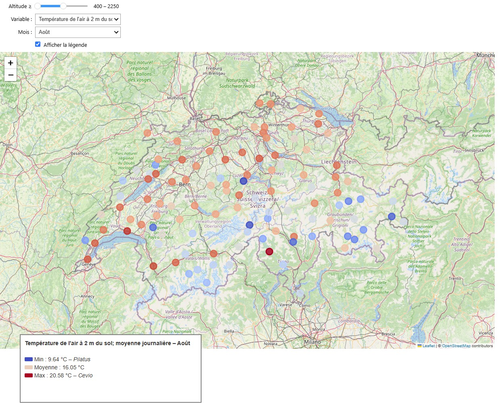
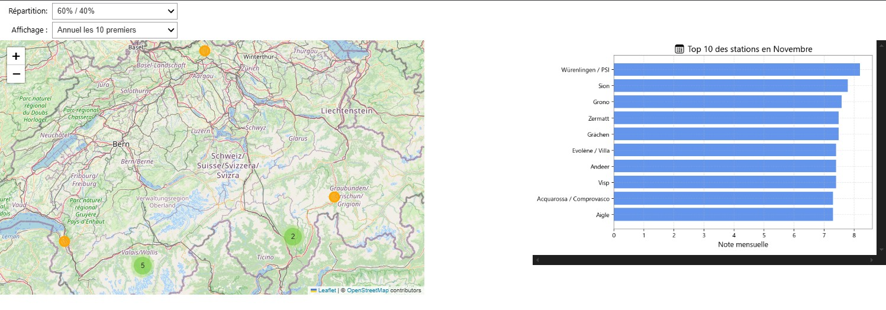

  <h1 style="font-size: 2.5em; color: #2a6592; margin-bottom: 10px;">StatisticalWeather</h1>
  <h3 style="color: #444; margin-top: 0;">Projet d'analyse de données</h3>

  

    Réalisé par <strong>Christophe</strong> et <strong>Guillaume</strong> 
  

## Introduction

Chacun des deux auteurs de se projet revendiquent de résider dans la plus belle région de Suisse. L'un est un valaisan convaincu et l'autre un fribourgeois qui ne l'est pas moins. A la recherche d'une solution pour déclarer le vainqueur, nous avons décidé de laisser de côté la partie subjective de la question pour faire place à une analyse des données météoroligiques que fourni **MeteoSuisse**. L'objectif étant de pouvoir visualiser sur une carte quelle région (station de mesure) dipose de quel ensoleillement relatif, de quelles températures moyennes par mois et de quel taux de précipitations. Notre carte interractive dispose de curseurs qui permettent de séléctionner une tranche d'altitude, afin de pouvoir comparer les données de manière plus équitables. \

Pour terminer nous avons établi un score par station, sur une échelle de 1 à 10, afin de déterminer quelle région avait le climat le plus favorable.

## Screenshots

## 🛠️ Mode d'emploi du Notebook

1. **Clonez le projet** :
    [StatisticalWeather – GitHub](https://github.com/Inertie78/StatisticalWeather/tree/main)

2. **Créez et activez un environnement virtuel** :

    Sous **Windows** :
        -   python -m venv .venv

        -   .venv\Scripts\activate

        -   pip install -r requirements.txt

    Sous **Linux/macOS** :
        
    -   python3 -m venv .venv
    -   source .venv/bin/activate
    -   pip install --upgrade pip
    -   pip install -r requirements.txt
      

3. **Ouvrez le fichier** `StatisticalWeather.ipynb` et lancez les codes.

---

